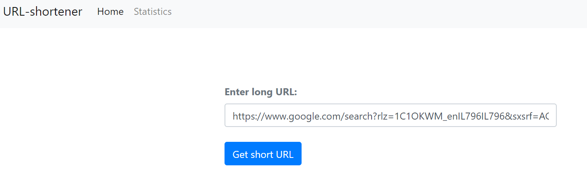
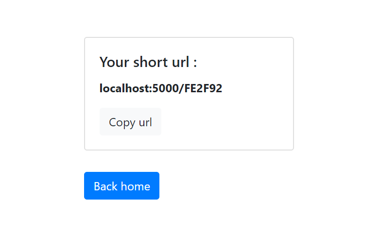
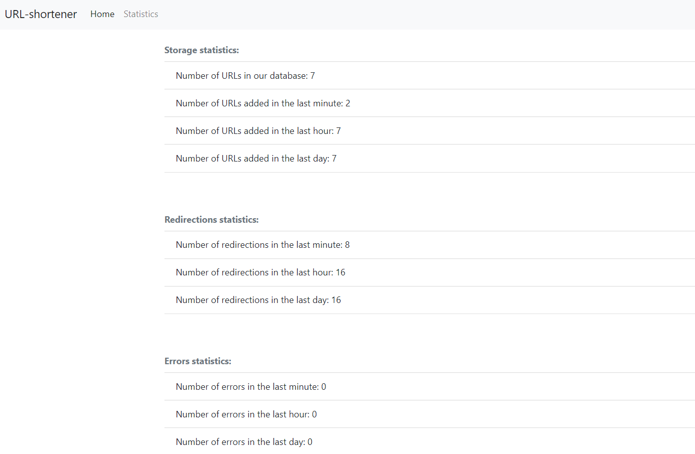

# URL-shortener-service

URL shortener service
Input: long URL.
Output: a short URL that redirects to the inserted URL.

#Requirements

Flask (pip install flask) is required.

#run

1-cd into Source code folder.
2-execute command : python app.py

# Images

---------------------------------------------------------------------------------
---------------------------------------------------------------------------------

---------------------------------------------------------------------------------
---------------------------------------------------------------------------------

